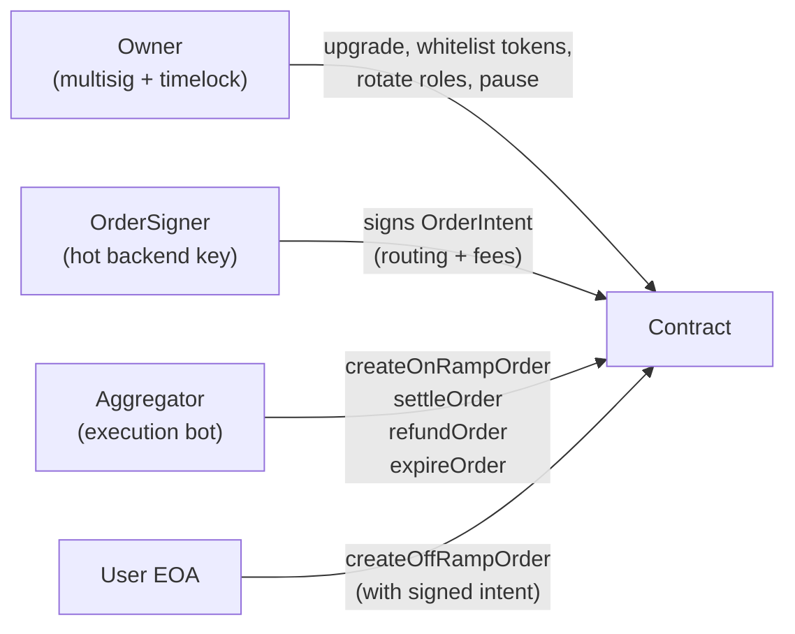
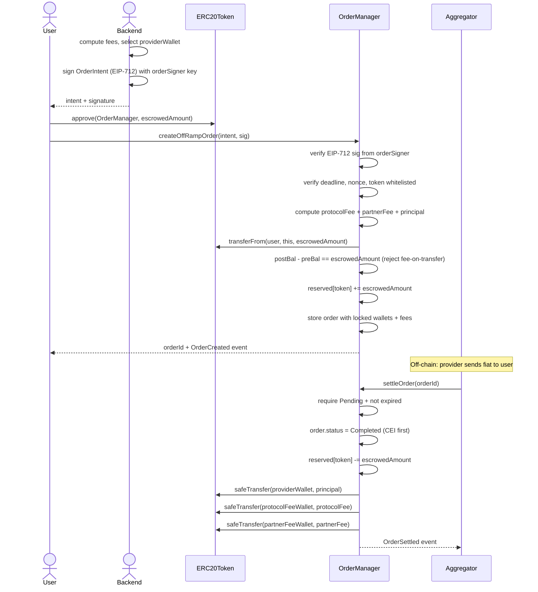
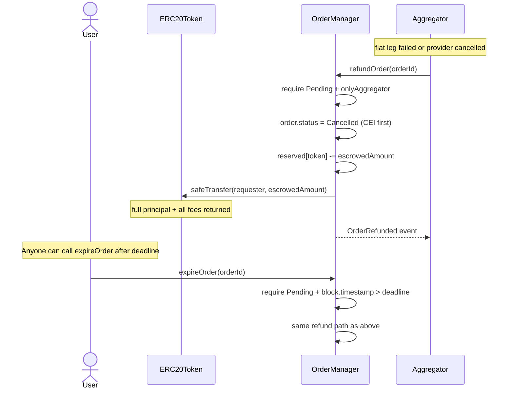
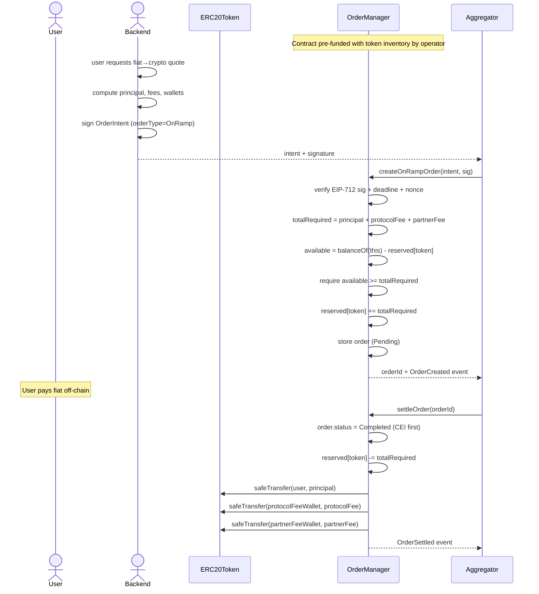
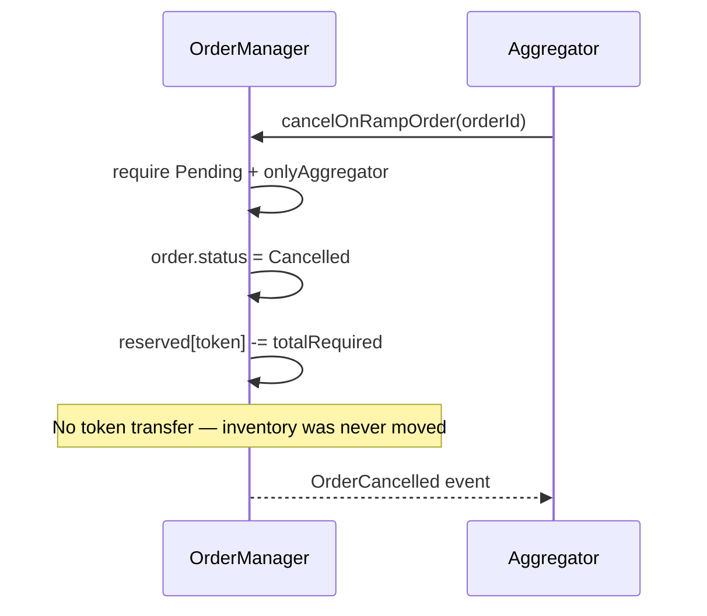
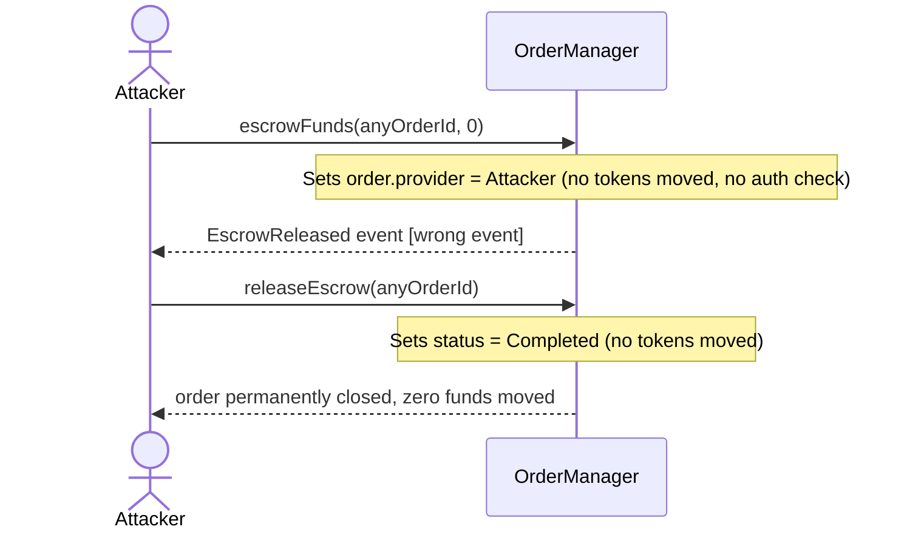
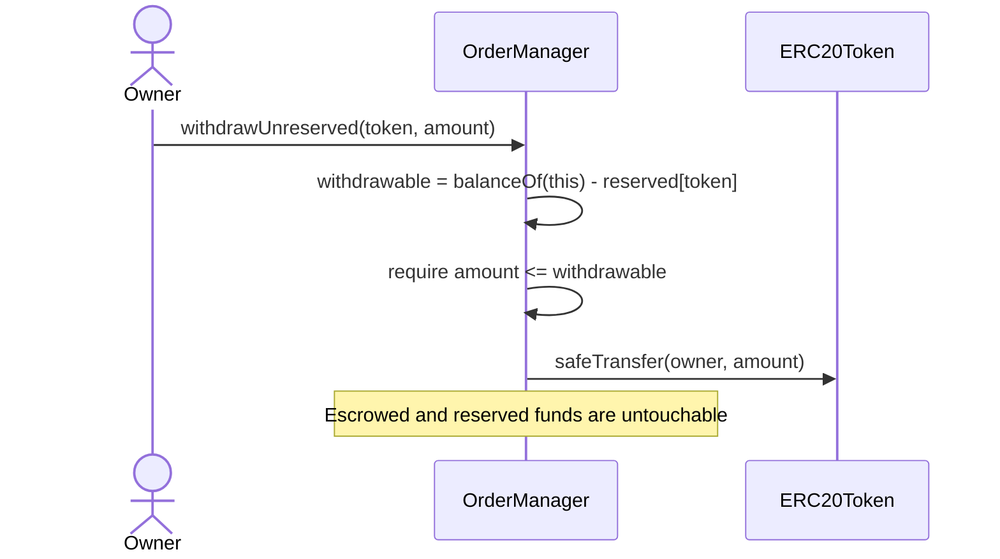
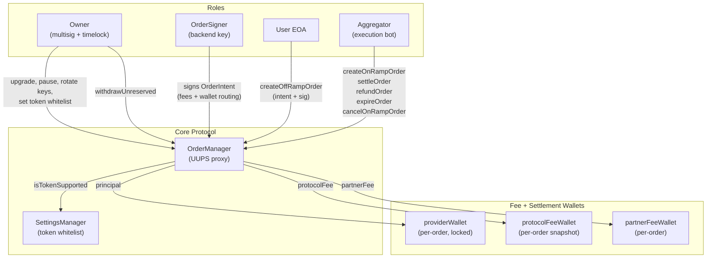

# OrderManagement.sol — Full Production Audit

**Output file:** `docs/audit.md` (to be created in the project root)

## Findings Summary

```
CRITICAL    5 issues  (must fix before mainnet)
IMPORTANT   7 issues  (fix before launch)
OPTIONAL    4 issues  (quality / future-proofing)
```

---

## CRITICAL Issues

### C1 — No fee logic despite `MAX_BPS` constant being declared

**File:** `[contracts/OrderManagement.sol](contracts/OrderManagement.sol)` lines 30, 191–212

`MAX_BPS = 100_000` is declared but **never used**. `settleOrder` transfers `order.amount` in full — no protocol fee, no partner fee, no provider fee is ever computed or deducted. This means the contract is incapable of generating protocol revenue and cannot route funds to a liquidity provider wallet. Settlement of an OffRamp always dumps 100% of the escrowed tokens to a single `treasury` address.

**What is missing entirely:**

- Protocol fee deduction and transfer to `protocolFeeWallet`
- Partner/integrator fee split to `partnerFeeWallet`
- Principal routing to `providerWallet` (the LP who fulfilled the fiat leg)
- Per-order fee parameters locked at intent-signing time

**Required data model additions (per order):**

```solidity
struct Order {
    // ... existing fields ...
    address providerWallet;      // principal destination (LP for OffRamp, user for OnRamp)
    address protocolFeeWallet;   // locked at order creation; immune to treasury changes mid-flight
    address partnerFeeWallet;    // integrator cut
    uint256 protocolFee;         // pre-computed at creation, stored in token units
    uint256 partnerFee;          // pre-computed at creation, stored in token units
    uint256 principal;           // escrowedAmount - protocolFee - partnerFee
    uint256 deadline;            // expiry timestamp
}
```

**Required settlement logic:**

```solidity
// CEI: mark before transfers
order.status = OrderStatus.Completed;
reserved[order.token] -= order.escrowedAmount;

token.safeTransfer(order.providerWallet,    order.principal);
token.safeTransfer(order.protocolFeeWallet, order.protocolFee);
if (order.partnerFee > 0)
    token.safeTransfer(order.partnerFeeWallet, order.partnerFee);
```

---

### C2 — Collision-prone order ID — frontrunnable and replay-vulnerable

**File:** `[contracts/OrderManagement.sol](contracts/OrderManagement.sol)` lines 140–141

```solidity
orderId = keccak256(abi.encodePacked(block.timestamp, _userAddress, _amount, _token));
```

`block.timestamp` has 1-second granularity. Two orders from the same user for the same amount/token in the same block produce identical IDs. Also exploitable cross-chain: a replay on a forked chain reuses the same orderId.

The production fix is to eliminate this pattern entirely by deriving `orderId` from the EIP-712 signed intent hash — which is already globally unique by construction (nonce + chainId + contract address).

```solidity
orderId = keccak256(abi.encode(OFFRAMP_TYPEHASH, intent.requester, intent.nonce, ...));
// nonce incremented: userNonce[intent.requester]++
```

---

### C3 — CEI violation — reentrancy in `refundOrder` and `settleOrder`

**File:** `[contracts/OrderManagement.sol](contracts/OrderManagement.sol)` lines 178–184, 199–211

In both functions, `order.status` is written **after** external ERC-20 transfers. With a hook-enabled token (ERC-777 or callback ERC-20), a malicious requester re-enters before status is set and drains double the escrowed amount.

**Fix:** Status transition first, transfers last. Add `ReentrancyGuardUpgradeable`.

```solidity
order.status = OrderStatus.Cancelled;       // ← before any external call
reserved[order.token] -= order.escrowedAmount;
token.safeTransfer(order.requester, order.escrowedAmount);
```

---

### C4 — `escrowFunds` moves no tokens and has no access control

**File:** `[contracts/OrderManagement.sol](contracts/OrderManagement.sol)` lines 285–293

`escrowFunds` only sets `order.provider = msg.sender` — no `transferFrom`, no token movement. Any address can call it on any pending order, hijacking the provider role at zero cost. `releaseEscrow` then lets that same address mark the order `Completed` with no token settlement. Combined, these two functions let an attacker permanently close any order while moving zero funds.

**Fix:** Remove `escrowFunds` and `releaseEscrow` entirely. The new intent-based model (described in the Architecture section) eliminates the need for a separate escrow step — OnRamp inventory is reserved at `createOnRampOrder` time, not via a separate provider-initiated call.

---

### C5 — OnRamp inventory over-commitment — no reservation accounting

**File:** `[contracts/OrderManagement.sol](contracts/OrderManagement.sol)` lines 130–133

```solidity
require(IERC20(_token).balanceOf(address(this)) >= _amount, "Insufficient funds");
```

This is a point-in-time check with no follow-through. Ten concurrent OnRamp orders can all pass this check against the same 1,000 USDC balance, then nine of the ten `settleOrder` calls will fail mid-flight after the first transfer drains the pool.

**Fix:** `reserved[token]` mapping tracks committed inventory. Only `balanceOf(this) - reserved[token]` is available for new orders:

```solidity
mapping(address => uint256) public reserved;

// At createOnRampOrder:
uint256 available = IERC20(token).balanceOf(address(this)) - reserved[token];
if (available < totalRequired) revert InsufficientInventory(token, totalRequired, available);
reserved[token] += totalRequired;

// At settleOrder / cancelOnRampOrder:
reserved[token] -= totalRequired;
```

Owner withdrawals are capped to unreserved balance:

```solidity
uint256 withdrawable = IERC20(token).balanceOf(address(this)) - reserved[token];
if (amount > withdrawable) revert WithdrawalExceedsUnreserved();
```

---

## IMPORTANT Issues

### I1 — No token allowlist — arbitrary ERC-20 accepted

`createOrder` accepts any `_token`. The `SettingsManager` contract (`contracts/OrderManagerSetting.sol`) exists but is never consulted. A malicious token can return `true` from `transfer()` while moving nothing. Fee-on-transfer tokens silently under-escrow.

**Fix:** Gate on `ISettingsManager.isTokenSupported(_token)`. Verify actual balance delta after `transferFrom` (pre/post balance check) to reject fee-on-transfer tokens. Switch all transfers to OZ `SafeERC20`.

---

### I2 — No EIP-712 signer role — aggregator controls order economics

The current model allows the aggregator (an execution bot) to call `createOrder` with any `_amount`, any `_token`, and any `_userAddress`. There is no signed authorization from a trusted backend key. This means a compromised aggregator can create arbitrary orders, drain inventory, or route settlement to wrong addresses.

**Fix:** Introduce `orderSigner` role (a distinct backend key). All order creation requires a valid EIP-712 signature from `orderSigner`. The aggregator can only execute the state machine — it cannot alter the economics.

```solidity
address internal _orderSigner;

function createOffRampOrder(OrderIntent calldata intent, bytes calldata sig) external {
    _verifyIntent(intent, sig);   // EIP-712 verify against _orderSigner
    // ... rest of creation logic
}
```

---

### I3 — `settleOrder` is `payable` for no reason

The function accepts ETH but has no `receive()`, no ETH accounting, and no withdrawal path. ETH sent to it is permanently locked. Remove `payable` from both implementation and interface.

---

### I4 — Duplicate / inconsistent interface files

Three interface definitions exist with diverging signatures:

- `contracts/interfaces/IOrderManagement.sol` — current, has `OrderType` enum
- `contracts/IOrderManagement.sol` — stale root-level copy, missing `OrderType`, different `createOrder` signature
- Commented-out old signature inside the active interface

**Fix:** Delete `contracts/IOrderManagement.sol`. Delete commented-out dead code.

---

### I5 — Pragma version mismatch

Implementation: `^0.8.22`. Interface: `^0.8.18`. Lock all files to `0.8.22` (no caret).

---

### I6 — `approveTokensForContract` must be deleted

```solidity
function approveTokensForContract(address _token, uint256 _amount) external {
    IERC20(_token).approve(address(this), _amount);
```

A contract approving itself is nonsensical. This is a Remix debug artifact. In production it is a dead call that confuses auditors and static analysis tools. Delete entirely.

---

### I7 — No deadline / expiry on orders

Orders have no `deadline` field. A pending OffRamp order with escrowed user funds can sit indefinitely — the user has no trustless recourse if the aggregator goes offline. Anyone should be able to call `expireOrder(orderId)` once `block.timestamp > order.deadline`, which triggers the same refund path as `refundOrder`.

---

## OPTIONAL Optimizations

### O1 — Struct packing

Pack `status` (uint8), `orderType` (uint8), and `requester` (address, 20 bytes) into a single 32-byte slot. Change `messageHash` from `string` (dynamic, multiple slots) to `bytes32` (single slot). Remove redundant `orderId` field from the struct (the mapping key is the ID).

### O2 — `getOrder` returns 8 individual values

Return the `Order` struct directly to reduce stack pressure and ABI verbosity.

### O3 — `getContractAddress()` is useless

Remove — callers always know the contract address.

### O4 — Storage gap missing

Add `uint256[47] private __gap;` for safe UUPS upgrade headroom.

---

## Fee Architecture

### Fee Model

Fees are **computed off-chain** by the backend, **signed** into the `OrderIntent` by `orderSigner`, and **enforced on-chain** at creation. This makes fee parameters tamper-proof after signing.

```
escrowedAmount = principal + protocolFee + partnerFee

protocolFee = principal * protocolFeeBps / 100_000
partnerFee  = principal * partnerFeeBps  / 100_000
```

`protocolFeeBps` and `partnerFeeBps` are per-order values embedded in the signed intent — not global state. This enables per-partner pricing and promotional rates without contract upgrades.

### Fee Recipients (all locked per-order at creation)


| Recipient            | Field               | Description                                                                  |
| -------------------- | ------------------- | ---------------------------------------------------------------------------- |
| Protocol             | `protocolFeeWallet` | Snapshot of treasury at signing time — immune to `updateTreasury` mid-flight |
| Partner / integrator | `partnerFeeWallet`  | The dApp or SDK that originated the order                                    |
| Liquidity provider   | `providerWallet`    | For OffRamp: LP who pays fiat; For OnRamp: the user receiving tokens         |


### Settlement Transfers (OffRamp)

```
Token flow at settleOrder:
  escrowedAmount (held in contract)
    → principal       → order.providerWallet   (LP wallet)
    → protocolFee     → order.protocolFeeWallet
    → partnerFee      → order.partnerFeeWallet  (skipped if 0)
```

### Settlement Transfers (OnRamp)

```
Token flow at settleOrder:
  totalRequired (reserved from inventory)
    → principal       → order.requester         (user receives tokens)
    → protocolFee     → order.protocolFeeWallet
    → partnerFee      → order.partnerFeeWallet  (skipped if 0)
```

### Refund Guarantee

On refund or expiry, the **full `escrowedAmount`** (principal + all fees) is returned to `order.requester`. No fees are charged on failed orders. This is deterministic — the stored `escrowedAmount` is the exact amount pulled at creation, verified by pre/post balance check.

---

## Sequential Flow Diagrams

### Roles




### OffRamp Flow — Production Grade




### OffRamp Refund Flow




### OnRamp Flow — Production Grade




### OnRamp Cancel Flow (fiat never arrived)




### Current Broken Escrow Flow (for reference — to be removed)




### Safe Admin Withdrawal




---

## Architectural Proposal

### Role Separation (production)




### Key Design Principles

- **Signer authorizes economics; Aggregator only executes.** A compromised aggregator cannot change fee rates, wallet addresses, or order amounts — those are baked into the signed intent.
- `**protocolFeeWallet` is snapshotted per-order at creation.** Calling `updateTreasury` mid-flight does not affect already-created orders. No funds are silently re-routed.
- `**reserved[token]` is the single source of truth for solvency.** Neither the owner nor concurrent orders can steal inventory backing a pending order.
- **Fee-on-transfer tokens are explicitly rejected** via pre/post balance verification — no silent under-escrow.
- **Refunds always return `escrowedAmount` in full** — the exact amount verified at deposit, not a recomputed value.

---

## Interface (`IOrderManagement.sol`) Required Changes

- Replace `createOrder` with `createOffRampOrder(OrderIntent, bytes)` and `createOnRampOrder(OrderIntent, bytes)`
- Remove `escrowFunds` and `releaseEscrow` (eliminated by intent model)
- Remove `payable` from `settleOrder`
- Add `cancelOnRampOrder` and `expireOrder`
- Move all events into the interface (currently only in implementation)
- Add `OrderIntent` struct and `OrderType` enum as top-level interface types
- Lock pragma to `0.8.22` (no caret)
- Delete `contracts/IOrderManagement.sol` (stale root-level duplicate)

