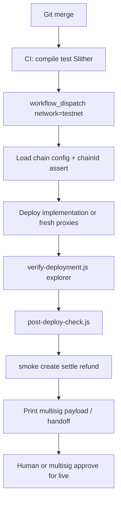
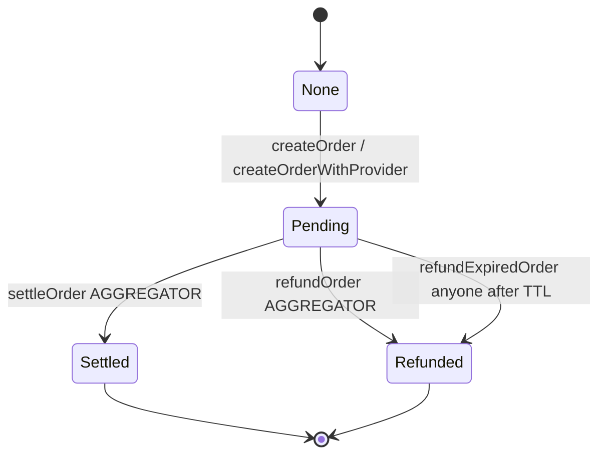
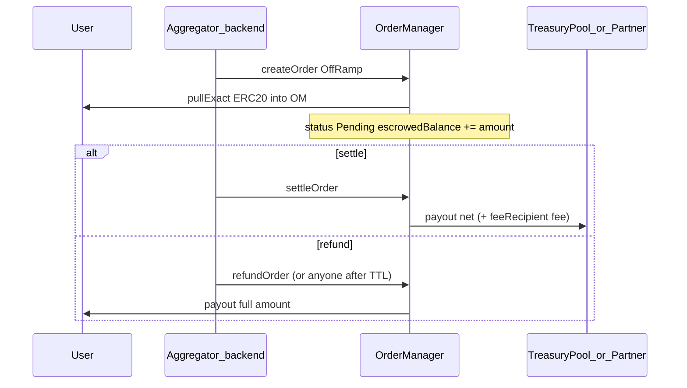
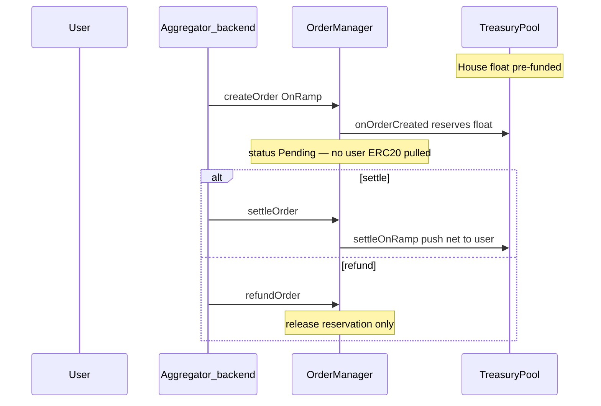

# Multichain operations — ElementFlow

ElementFlow is an **independent per-chain** EVM deployment. Upgrading Base does **not** upgrade Scroll, Lisk, or any other network.

## Chain matrix (public addresses only)

| Chain | Chain ID | Status | OrderManager proxy | Impl (v1 era) | Notes |
|-------|----------|--------|--------------------|---------------|-------|
| Base | 8453 | live | `0x55f2761afdD2bfBeDeE19D0439d686302CD2b150` | `0x6eFD13b4…B59f` | v1 live; v2 Registry/Pool not yet on mainnet |
| Base Sepolia | 84532 | testnet | `0x5cB2B2b5f8E373bb9c44Cbc190FF103d2bd11716` | `0xe74781Ee…1095` | **v2 lab** (2026-09-14); Registry `0x53757B…F854`, Pool `0xE909CF…d0B2` |
| Scroll / Scroll Sepolia | 534352 / 534351 | planned | — | — | config stubs only |
| Lisk / Lisk Sepolia | 1135 / 4202 | planned | — | — | config stubs only |
| Arbitrum / Arb Sepolia | 42161 / 421614 | planned | — | — | scaffold only |
| Polygon | — | not configured | — | — | add via [ADD_CHAIN_CHECKLIST.md](ADD_CHAIN_CHECKLIST.md) |

Source of truth: [`config/chains/`](../config/chains/). **Always key by `(chainId, address)`** — the same address string can appear on more than one chain.

## Configuration model

Each `config/chains/<chainId>.<slug>.json` includes: `chainId`, `name`, `hardhatNetwork`, `status`, RPC/explorer env keys, `tokens[]`, `contracts{}`, `roles{}`, `deployment{}`.

Loader: [`scripts/lib/chainConfig.js`](../scripts/lib/chainConfig.js)

- Deploy/upgrade/scan **assert** `provider.chainId === config.chainId`
- `status=planned` cannot deploy
- `status=live` requires distinct role env vars (no deployer fallback)
- `PROXY_ADDRESS` must match `contracts.orderManagerProxy` unless `ALLOW_PROXY_OVERRIDE=1`
- `ALLOWED_TOKENS` must be a subset of config tokens when the config list is non-empty

Secrets (`PRIVATE_KEY`, explorer API keys, RPCs with keys) stay in `.env` / CI secrets — never in JSON.

## Deployment pipeline (no auto prod)



**Verify is a required deploy step** (not optional):

```bash
# One Etherscan API v2 key covers Base + Base Sepolia (Basescan V1 is dead)
# https://etherscan.io/apidashboard
export ETHERSCAN_API_KEY=...

npx hardhat run scripts/deploy.js --network base-sepolia
# deploy.js calls verify-deployment.js automatically (set REQUIRE_VERIFY=0 to skip)

# Or re-verify an existing artifact:
DEPLOYMENT_FILE=deployments/84532.base-sepolia.latest.json \
  npm run verify:deployment -- --network base-sepolia
```

Confirm on the explorer that each proxy shows **Read/Write as Proxy** with the implementation ABI.

- PR CI: [`.github/workflows/ci.yml`](../.github/workflows/ci.yml) — compile + test; **never** deploys production.
- Testnet: [`.github/workflows/deploy-testnet.yml`](../.github/workflows/deploy-testnet.yml) — `workflow_dispatch` only; `base-sepolia` allowlisted; includes verify step.
- Production Base upgrades: local/ops + multisig — not CI.

## Upgrade management (per chain)

1. Build new implementation.
2. Run full Hardhat tests.
3. `upgrades.validateUpgrade` (upgrade script).
4. Chain-specific compatibility (tokens, roles, pause state).
5. Deploy implementation to **target chain only**.
6. **Verify on explorer** (`scripts/verify-deployment.js`) — confirm Read/Write as Proxy.
7. Prepare upgrade tx / multisig payload.
8. Multisig/admin review.
9. Execute upgrade on that chain.
10. `scripts/post-deploy-check.js` + escrow/role asserts.
11. Monitoring / smoke on that chain only.

Never fan-out upgrades across chains in one action.

## Order lifecycle (v2)

Status: `None → Pending → Settled | Refunded`. Order id: `keccak256(chainId, address(this), requester, amount, token, orderType, intentKey)`.



### Off-ramp (user crypto → fiat)

User tokens are escrowed on **OrderManager**. Settle sends principal to `treasury` (or provider adapter) + fee to feeRecipient. Refund returns the full amount to the user.



### On-ramp (fiat → user crypto)

User does **not** escrow. House float sits on **TreasuryPool** (`fund`) when `defaultProviderId` is set, or on OM (`depositLiquidity`) for internal `providerId=0`. Create only reserves; settle pushes ERC20 to the user; refund clears the reservation.



See also [AGGREGATOR_LISTENER_HANDOFF.md](AGGREGATOR_LISTENER_HANDOFF.md).

**Pause note:** manager pause also blocks `refundExpiredOrder` — long halts freeze user self-refund liveness on that chain only.

## Incident response

See [INCIDENT_RESPONSE.md](INCIDENT_RESPONSE.md) — pause **one chain**, keep others up when safe.

## Adding a chain

See [ADD_CHAIN_CHECKLIST.md](ADD_CHAIN_CHECKLIST.md). Compiling and deploying is not production-ready by itself.
