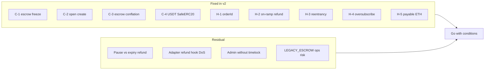

# ElementFlow v2 — QA & Security Audit Report (pre-deploy)

| Field | Value |
|-------|--------|
| **Date** | 2026-09-14 |
| **Branch** | `feat/elementflow-v2-order-manager` |
| **Review type** | Internal QA + security review (not a substitute for an external firm audit) |
| **Scope** | `ElementFlowOrderManager`, `ProviderRegistry`, `TreasuryPool`, upgrade/migration scripts |
| **Deploy gate** | Base mainnet — in-place v1→v2 upgrade **and** fresh v2 stack |
| **Tests** | **123 passing** (`npx hardhat test`) |
| **Static analysis** | Slither 0.11.6 (production contracts; mocks/legacy filtered) |

---

## Executive summary

**Verdict: Go-with-conditions** for Base mainnet.

All Critical/High findings from the v1 notebook audit are **fixed in v2** and covered by regression tests. Greptile P1 remediations (disabled-provider refunds, TreasuryPool `reservedLiquidity`, legacy on-ramp liquidity bound, fail-closed escrow scan, deploy `setDefaultProviderId`) are present in code.

Do **not** treat this as “ship without further process.” Mainnet requires operational controls listed below (multisig, escrow seed, aggregator/listener cutover, explorer verify). Residual risks are mostly **ops / adapter trust / pause liveness**, not unfixed C/H Solidity bugs.

---

## Method

1. Revalidated [`docs/ElementFlow-Security-Architecture.ipynb`](ElementFlow-Security-Architecture.ipynb) C/H/M findings against current Solidity.
2. Confirmed Greptile P1 fix commit themes still in tree.
3. Ran full Hardhat suite (123 pass).
4. Ran Slither on production contracts (excluding mocks/legacy).
5. Manual review of liquidity accounting, upgrade seed, adapters, pause, roles.

---

## Notebook revalidation (v1 → v2)

| ID | Severity | Title | Status in v2 |
|----|----------|-------|----------------|
| C-1 | Critical | Permissionless escrow freeze | **FIXED** — no public escrow mutators; off-ramp pull only in `_createOrder` |
| C-2 | Critical | Permissionless `createOrder` | **FIXED** — requester or `ORDER_CREATOR_ROLE` (`NotOrderCreator`) |
| C-3 | Critical | On-ramp pays from off-ramp escrow | **FIXED** — `escrowedBalance` + `reservedLiquidity` + `availableLiquidity` invariant |
| C-4 | Critical | `require(transfer)` bricks USDT | **FIXED** — `SafeERC20` + `_pullExact` |
| H-1 | High | Timestamp order IDs | **FIXED** — `computeOrderId(chainId, this, …, intentKey)` |
| H-2 | High | On-ramp never refundable | **FIXED** — `_refund` releases reservations; adapter `onOrderRefunded` |
| H-3 | High | No reentrancy guard | **FIXED** — `nonReentrant` on OM state changers |
| H-4 | High | Concurrent on-ramp oversubscribe | **FIXED** — reserve at create (OM internal + TreasuryPool) |
| H-5 | High | Payable settle loses ETH | **FIXED** — no payable settlement; no native receive |
| M-1…M-6 | Medium | Approve-self, allowlist, Ownable, expiry, fees, dead Settings | **FIXED** as documented in notebook |

---

## Greptile / follow-up remediations (confirmed)

| Item | Evidence |
|------|----------|
| Refunds resolve **disabled** providers | `_resolveProviderForRefund` → `requireRegisteredProvider` |
| TreasuryPool **`reservedLiquidity`** | Reserve on `onOrderCreated`; release on settle/refund; bound `defund` |
| Legacy on-ramp cannot eat off-ramp escrow | `settleLegacyOrder` uses `availableLiquidity` |
| Legacy scan **fail-closed** | `scan-legacy-orders.js` throws if an order cannot be read |
| Deploy sets **`defaultProviderId`** | `scripts/deploy.js` after registry wiring |
| Pause preserved across `initializeV2` | OZ 5.x `__Pausable_init` no-op; covered in `Upgrades.test.js` |

---

## Findings (this review)

Severity: **C** Critical · **H** High · **M** Medium · **L** Low · **I** Informational

| ID | Sev | Title | Status | Location | Recommendation |
|----|-----|-------|--------|----------|----------------|
| EF-01 | M | Manager pause blocks `refundExpiredOrder` | **Open (ops)** | `ElementFlowOrderManager.refundExpiredOrder` `whenNotPaused` | Document SLA; prefer `disableProvider` / pool pause when escrow liveness matters; see `INCIDENT_RESPONSE.md` |
| EF-02 | M | Malicious/buggy `onOrderRefunded` can brick refunds | **Open (accepted adapter trust)** | OM `_refund` → adapter hook after status=Refunded | Only register audited adapters; guardian `disableProvider` does **not** skip refund hooks for registered adapters — monitor + hot-swap carefully; add regression test for revert DoS |
| EF-03 | M | `setProviderRegistry(address(0))` allowed | **Open** | `setProviderRegistry` | Reject zero address (same as treasury/feeRecipient) |
| EF-04 | M | No on-chain timelock for `UPGRADER_ROLE` / admin | **Open (ops)** | AccessControl roles | Hold admin/upgrader on Safe + Timelock before mainnet; never EOA |
| EF-05 | M | `LEGACY_ESCROW` undercount → user escrow treated as float | **Open (ops)** | `upgrade-v1-to-v2.js` / `initializeV2` | Mandatory dual-operator review of scan output; never upgrade with empty seed if pending off-ramps exist |
| EF-06 | L | Partner adapters may not reserve liquidity | **Open** | Non-TreasuryPool `IOnRampProvider` | Require reservation semantics in adapter checklist; default path uses TreasuryPool |
| EF-07 | L | Fee recipient balance not verified on provider on-ramp | **Accepted** | `_settleOnRampViaProvider` | User net is verified; fee skim is trusted-adapter / accounting risk only |
| EF-08 | L | Pool `settleOffRamp` / hooks lack `nonReentrant` | **Informational** | `TreasuryPool` | OM already `nonReentrant`; low risk for in-house pool; add guards if third-party callers ever appear |
| EF-09 | I | Slither `reentrancy-balance` on on-ramp settle | **False positive / mitigated** | `_settleOnRampViaProvider` | Called only from `settleOrder` (`nonReentrant`); balance-delta check is intentional |
| EF-10 | I | Slither timestamp / strict-equality / complexity | **Informational** | TTL refund, status checks | Expected for expiry; no change required |
| EF-11 | I | Dual allowlists (manager + pool) can diverge | **Ops** | `setTokenAllowed` / `setTokenSupported` | Always set both in deploy/post-check; CI already has post-deploy sync check |
| EF-12 | I | No fuzz/invariant suite; Slither not gating CI | **QA gap** | `.github/workflows/ci.yml` | Make Slither blocking or artifact; add Foundry/Hardhat invariants before large TVL |

No **new Critical or High** Solidity defects were identified in this pass beyond residual operational/adapter items above.

---

## Slither summary

- **Analyzed:** production contracts (mocks/legacy filtered).
- **Actionable:** none that contradict CEI + `nonReentrant` on OM entrypoints.
- **Noise:** `__gap` naming, unused-state on gaps, solc pragma on legacy interface file.
- **CI today:** Slither is `continue-on-error` — treat as informational until gated.

---

## Test / QA snapshot

| Suite | Role |
|-------|------|
| `OrderLifecycle` | Happy paths, idempotency, expiry, ABI |
| `Security` | ACL, pause, reentrancy, hostile tokens, fees, liquidity |
| `ProviderFlows` | Registry, adapters, TreasuryPool reserves, disabled refunds |
| `Upgrades` | v1 exploits + in-place migration + layout + legacy on-ramp bound |
| `Multichain` | chainId-bound order ids + config loader |

**Gaps (recommended follow-ups, not blockers if ops conditions met):**
1. Fuzz / invariant: `balance ≥ escrowed + reserved` (OM + pool) under random sequences.
2. Explicit test: `onOrderRefunded` revert traps refund (document ops response).
3. Adapter hot-swap mid-pending settle/refund.
4. Coverage gate + Mythril optional in CI.

---

## Pre-deploy checklist (Base)

### Fresh v2 stack

- [ ] `BASE_*` roles: **Safe/multisig** for admin, treasury, fee recipient; hot keys only for aggregator / order-creator
- [ ] `deployment.requireDistinctRoles` / live hard-fail — no deployer fallback
- [ ] Fund **TreasuryPool** (`fund`) before on-ramps; allowlist tokens on **manager and pool**
- [ ] `ETHERSCAN_API_KEY` + `npm run verify:deployment` — Read/Write as Proxy works
- [ ] `post-deploy-check.js` green
- [ ] Aggregator + listener cutover ([`AGGREGATOR_LISTENER_HANDOFF.md`](AGGREGATOR_LISTENER_HANDOFF.md))

### In-place v1 → v2 upgrade (live proxy)

- [ ] Pause policy agreed (pause blocks expiry refunds)
- [ ] `scan-legacy-orders.js` fail-closed run → `LEGACY_ESCROW=…` dual-reviewed
- [ ] `upgrades.validateUpgrade` + storage layout CI green
- [ ] Upgrade via **UPGRADER** multisig only
- [ ] Post-upgrade: legacy pending drain path tested on staging; `post-deploy-check`
- [ ] Backend: custom errors + `OrderAlreadyExists` idempotent; v2 settle/refund event ABI

### Explicitly out of this report

External firm audit, bug bounty, full fuzz campaign, mainnet tx execution.

---

## Recommendations (priority)

1. **P0 — Ops before upgrade/deploy:** multisig + distinct roles; correct `LEGACY_ESCROW`; verify explorer; liquidity funding.
2. **P0 — Backend:** ship aggregator/listener v2 cutover before flipping production traffic.
3. **P1 — Code (small):** reject `setProviderRegistry(0)`; optional `nonReentrant` on pool hooks.
4. **P1 — Tests:** refund-hook revert DoS + invariant/fuzz for dual ledgers.
5. **P2 — CI:** gate Slither (or upload SARIF); refresh notebook “113 tests” claim → 123.
6. **P2 — Governance:** TimelockController in front of upgrader for mainnet.

---

## Residual accepted risks (unchanged from notebook intent)

- Aggregator can settle vs user racing `refundExpiredOrder` near TTL (prefer settle; document).
- Provider on-ramp: only user net amount verified, not fee recipient.
- Admin compromise can retarget registry/treasury (mitigate with multisig/timelock).
- Malicious token **after** allowlist (ops discipline on allowlist).

---

## Conclusion

ElementFlow v2 is **ready for mainnet process** under **Go-with-conditions**: contracts close the v1 Critical/High class, Greptile P1s are in place, and 123 automated tests pass. Proceed only after the pre-deploy checklist (especially upgrade seeding and role/multisig setup) and backend cutover are complete. Schedule an **external audit** before large TVL.
