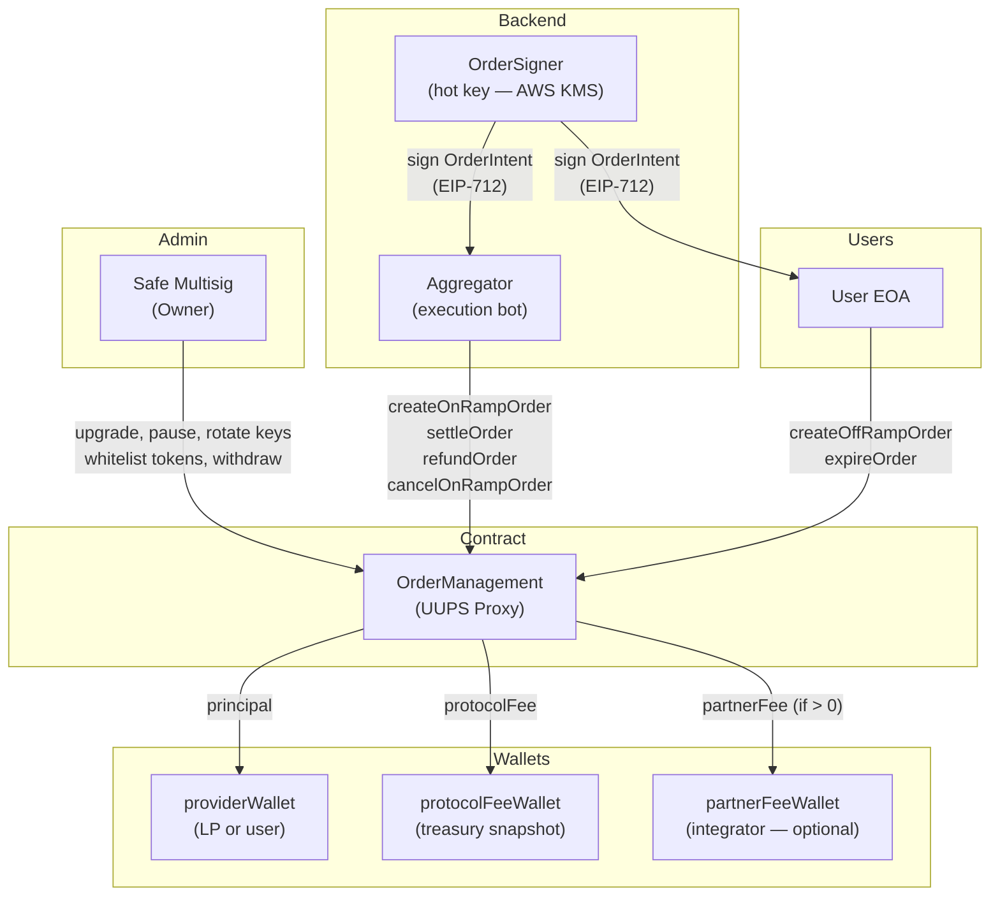
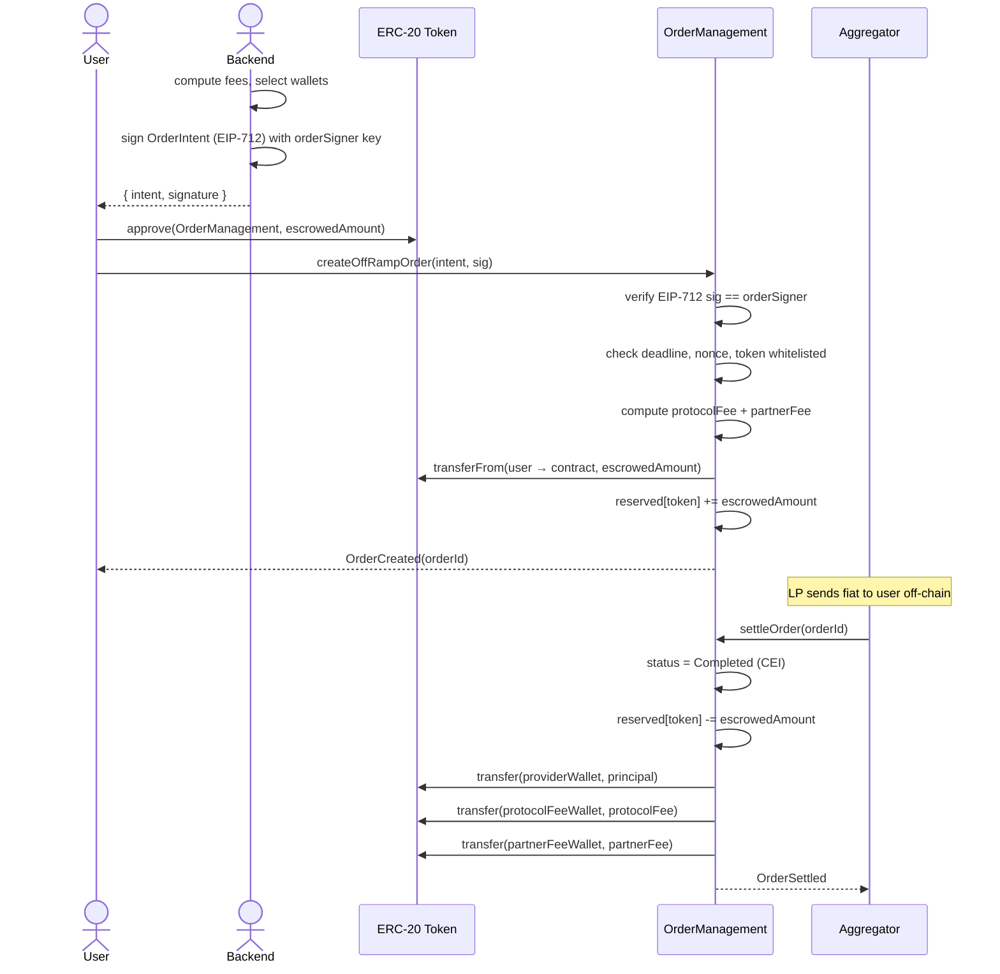
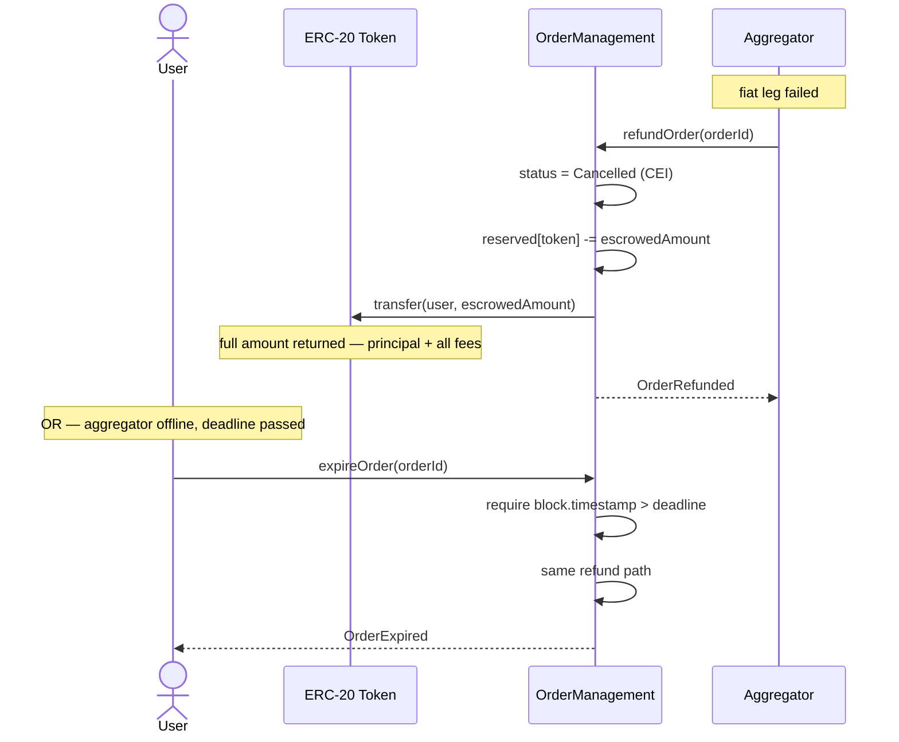
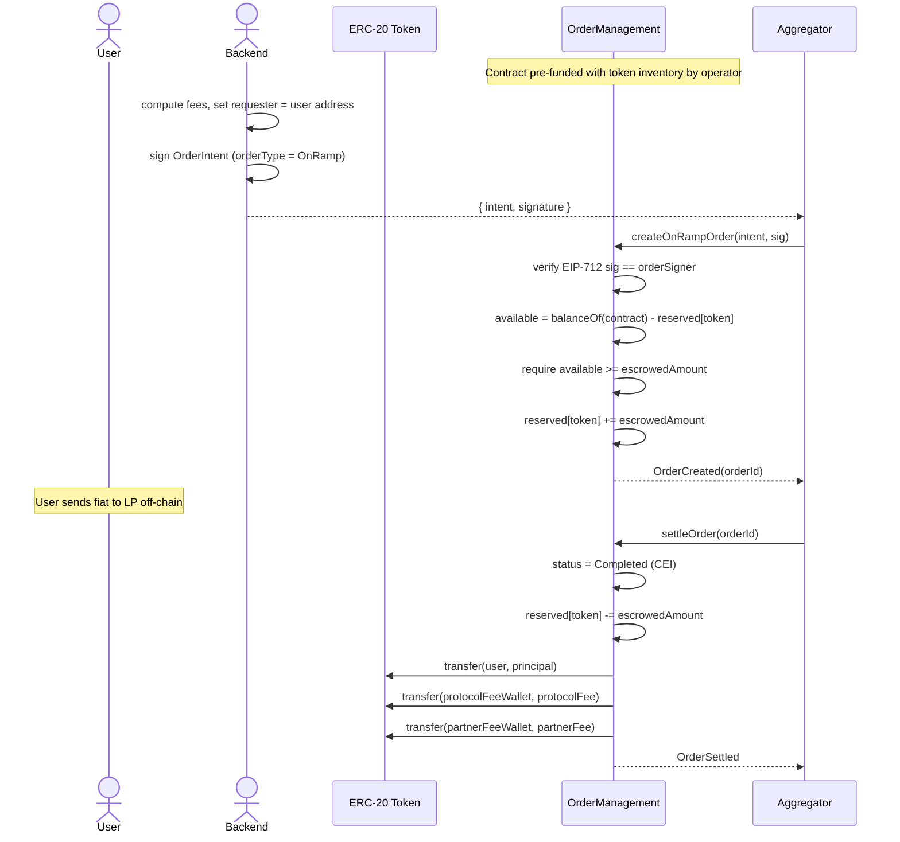

# ElementFlow — Integration & Security Reference

## Table of Contents

1. [Security Model](#1-security-model)
2. [Roles & Responsibilities](#2-roles--responsibilities)
3. [Fund Flow — OffRamp](#3-fund-flow--offramp)
4. [Fund Flow — OnRamp](#4-fund-flow--onramp)
5. [Sequence Diagrams](#5-sequence-diagrams)
6. [Code Samples — JavaScript (ethers.js)](#6-code-samples--javascript-ethersjs)
7. [Code Samples — Python (web3.py)](#7-code-samples--python-web3py)

---

## 1. Security Model

```
┌─────────────────────────────────────────────────────────────────┐
│                        TRUST HIERARCHY                          │
│                                                                 │
│   Safe Multisig (2-of-3)                                        │
│   └── Owner of OrderManagement proxy                           │
│       ├── Can upgrade contract (UUPS)                           │
│       ├── Can rotate OrderSigner and Aggregator addresses       │
│       ├── Can whitelist / delist tokens                         │
│       ├── Can pause / unpause                                   │
│       └── Can withdraw unreserved funds                         │
│                                                                 │
│   OrderSigner (hot backend key — AWS KMS / Secrets Manager)     │
│   └── Signs EIP-712 OrderIntents                                │
│       ├── Locks: fees, amounts, wallet addresses, deadline      │
│       ├── Never submits transactions directly                   │
│       └── Compromised? → Owner rotates via multisig             │
│                                                                 │
│   Aggregator (execution bot wallet)                             │
│   └── Drives order state machine                                │
│       ├── createOnRampOrder / settleOrder / refundOrder         │
│       ├── CANNOT alter any signed parameter                     │
│       └── Compromised? → worst case: orders settled out of      │
│           order. No funds can be stolen.                        │
│                                                                 │
│   User (EOA)                                                    │
│   └── createOffRampOrder (with backend-signed intent)           │
│       └── expireOrder (trustless, after deadline)               │
└─────────────────────────────────────────────────────────────────┘
```

### Why Two Backend Keys?

| Scenario | OrderSigner compromised | Aggregator compromised |
|---|---|---|
| Can create fraudulent orders? | Yes | No — can't forge signature |
| Can change fee routing? | Yes (new orders only) | No — fees locked in signed intent |
| Can steal escrowed funds? | No — only existing orders settle normally | No — settlement sends to pre-signed wallets |
| Blast radius | Future orders only | Operational disruption only |
| Recovery | Owner rotates signer key | Owner rotates aggregator address |

### What EIP-712 Signing Guarantees

Every `OrderIntent` is a **tamper-proof commitment**. Once the OrderSigner signs:

```
requester, token, orderType, principalAmount,
protocolFeeBps, partnerFeeBps,
providerWallet, partnerFeeWallet, protocolFeeWallet,
providerId, nonce, deadline
```

— **no field can be changed**. If the aggregator or user modifies a single byte, `ECDSA.recover()` returns a wrong address and the contract reverts with `InvalidSignature()`.

### Replay Protection

- **Nonce:** `userNonce[requester]` increments after every verified intent. Same intent cannot be submitted twice.
- **Deadline:** Intent expires at `block.timestamp > deadline`. Old intents cannot be replayed later.
- **Chain ID:** Baked into the EIP-712 domain separator. Intents are chain-specific — a signature valid on Polygon is invalid on Base.

---

## 2. Roles & Responsibilities



---

## 3. Fund Flow — OffRamp

User wants to sell crypto for fiat. They escrow tokens; LP pays fiat off-chain; aggregator settles.

```
USER WALLET
    │
    │  approve(OrderManagement, escrowedAmount)
    │  createOffRampOrder(intent, sig)
    ▼
ORDER MANAGEMENT CONTRACT
    │  pulls escrowedAmount = principal + protocolFee + partnerFee
    │  reserved[token] += escrowedAmount
    │  stores Order { status: Pending, all wallets + fees locked }
    │
    │  ── off-chain: LP sends fiat to user ──
    │
    │  aggregator calls settleOrder(orderId)
    │
    ├──► principal        → providerWallet   (LP reimbursed)
    ├──► protocolFee      → protocolFeeWallet (treasury)
    └──► partnerFee       → partnerFeeWallet  (integrator, if > 0)

ON REFUND (fiat leg failed):
    └──► escrowedAmount   → user.requester   (full refund, all fees returned)
```

### OffRamp Fee Maths

```
escrowedAmount  = principal + protocolFee + partnerFee
protocolFee     = principal × protocolFeeBps / 100_000
partnerFee      = principal × partnerFeeBps  / 100_000

Example (principal = 100 USDC, protocolFee = 1%, partnerFee = 0.5%):
  protocolFee    = 100 × 1000 / 100_000 = 1.00 USDC
  partnerFee     = 100 × 500  / 100_000 = 0.50 USDC
  escrowedAmount = 101.50 USDC  ← user approves this amount
  principal      = 100.00 USDC  → LP wallet
```

---

## 4. Fund Flow — OnRamp

User wants to buy crypto with fiat. LP pre-funds the contract; user pays fiat off-chain; aggregator settles tokens to user.

```
OPERATOR pre-funds contract with token inventory
    │
    ▼
ORDER MANAGEMENT CONTRACT  (holds inventory)
    │
    │  aggregator calls createOnRampOrder(intent, sig)
    │  reserved[token] += escrowedAmount  (inventory locked)
    │  stores Order { status: Pending }
    │
    │  ── off-chain: user sends fiat to LP ──
    │
    │  aggregator calls settleOrder(orderId)
    │
    ├──► principal        → user (requester)       (receives tokens)
    ├──► protocolFee      → protocolFeeWallet       (treasury)
    └──► partnerFee       → partnerFeeWallet        (integrator, if > 0)

ON CANCEL (fiat never arrived):
    └──► reserved[token] -= escrowedAmount          (inventory released, no transfer)
```

---

## 5. Sequence Diagrams

### OffRamp — Happy Path



### OffRamp — Refund / Expiry



### OnRamp — Happy Path



---

## 6. Code Samples — JavaScript (ethers.js)

Install dependencies:
```bash
npm install ethers
```

### 6.1 — OrderSigner: Sign an OffRamp Intent

```js
import { ethers } from "ethers";

const ORDER_MANAGEMENT_ADDRESS = "0xYourContractAddress";
const CHAIN_ID = 137; // Polygon

/**
 * Called by the backend (OrderSigner key) to authorise an OffRamp order.
 * Returns the intent object and its EIP-712 signature.
 */
async function signOffRampIntent({
  signerPrivateKey,
  requester,
  token,
  principalAmount,       // BigInt, in token units (e.g. 100n * 10n**6n for 100 USDC)
  protocolFeeBps,        // e.g. 1000 = 1%
  partnerFeeBps,         // e.g. 500 = 0.5%, or 0 if no partner
  providerWallet,        // LP wallet that receives principal
  partnerFeeWallet,      // integrator wallet, or ethers.ZeroAddress if none
  protocolFeeWallet,     // treasury snapshot
  providerId,            // bytes32 off-chain reference, e.g. ethers.id("provider-xyz")
  currentNonce,          // fetch from contract: userNonce(requester)
  deadlineSeconds = 3600 // intent valid for 1 hour
}) {
  const signer = new ethers.Wallet(signerPrivateKey);

  const deadline = Math.floor(Date.now() / 1000) + deadlineSeconds;

  const domain = {
    name: "ElementFlow",
    version: "2",
    chainId: CHAIN_ID,
    verifyingContract: ORDER_MANAGEMENT_ADDRESS,
  };

  const types = {
    OrderIntent: [
      { name: "requester",          type: "address" },
      { name: "token",              type: "address" },
      { name: "orderType",          type: "uint8"   },
      { name: "principalAmount",    type: "uint256" },
      { name: "protocolFeeBps",     type: "uint256" },
      { name: "partnerFeeBps",      type: "uint256" },
      { name: "providerWallet",     type: "address" },
      { name: "partnerFeeWallet",   type: "address" },
      { name: "protocolFeeWallet",  type: "address" },
      { name: "providerId",         type: "bytes32" },
      { name: "nonce",              type: "uint256" },
      { name: "deadline",           type: "uint256" },
    ],
  };

  const intent = {
    requester,
    token,
    orderType: 1,          // 0 = OnRamp, 1 = OffRamp
    principalAmount,
    protocolFeeBps,
    partnerFeeBps,
    providerWallet,
    partnerFeeWallet,
    protocolFeeWallet,
    providerId,
    nonce: currentNonce,
    deadline,
  };

  const signature = await signer.signTypedData(domain, types, intent);

  return { intent, signature };
}
```

### 6.2 — User: Approve & Create OffRamp Order

```js
import { ethers } from "ethers";
import ORDER_MANAGEMENT_ABI from "./abi/OrderManagement.json" assert { type: "json" };
import ERC20_ABI from "./abi/ERC20.json" assert { type: "json" };

/**
 * Called by the user's frontend after receiving { intent, signature } from backend.
 */
async function createOffRampOrder({ userSigner, intent, signature }) {
  const token = new ethers.Contract(intent.token, ERC20_ABI, userSigner);
  const om    = new ethers.Contract(ORDER_MANAGEMENT_ADDRESS, ORDER_MANAGEMENT_ABI, userSigner);

  // Compute escrowedAmount = principal + protocolFee + partnerFee
  const protocolFee = (BigInt(intent.principalAmount) * BigInt(intent.protocolFeeBps)) / 100_000n;
  const partnerFee  = (BigInt(intent.principalAmount) * BigInt(intent.partnerFeeBps))  / 100_000n;
  const escrowedAmount = BigInt(intent.principalAmount) + protocolFee + partnerFee;

  // Step 1: approve
  const approveTx = await token.approve(ORDER_MANAGEMENT_ADDRESS, escrowedAmount);
  await approveTx.wait();
  console.log("Approved:", approveTx.hash);

  // Step 2: create order
  const tx = await om.createOffRampOrder(intent, signature);
  const receipt = await tx.wait();
  console.log("Order created:", tx.hash);

  // Parse orderId from event
  const event = receipt.logs
    .map(log => { try { return om.interface.parseLog(log); } catch { return null; } })
    .find(e => e?.name === "OrderCreated");

  const orderId = event?.args?.orderId;
  console.log("orderId:", orderId);
  return orderId;
}
```

### 6.3 — Aggregator: Create OnRamp Order

```js
/**
 * Called by the aggregator bot after receiving { intent, signature } from backend.
 */
async function createOnRampOrder({ aggregatorSigner, intent, signature }) {
  const om = new ethers.Contract(ORDER_MANAGEMENT_ADDRESS, ORDER_MANAGEMENT_ABI, aggregatorSigner);

  const tx = await om.createOnRampOrder(intent, signature);
  const receipt = await tx.wait();

  const event = receipt.logs
    .map(log => { try { return om.interface.parseLog(log); } catch { return null; } })
    .find(e => e?.name === "OrderCreated");

  const orderId = event?.args?.orderId;
  console.log("OnRamp order created:", orderId);
  return orderId;
}
```

### 6.4 — Aggregator: Settle an Order

```js
/**
 * Called by the aggregator once the off-chain leg is confirmed complete.
 */
async function settleOrder({ aggregatorSigner, orderId }) {
  const om = new ethers.Contract(ORDER_MANAGEMENT_ADDRESS, ORDER_MANAGEMENT_ABI, aggregatorSigner);

  const tx = await om.settleOrder(orderId);
  await tx.wait();
  console.log("Order settled:", tx.hash);
}
```

### 6.5 — Aggregator: Refund an OffRamp Order

```js
/**
 * Called when the fiat leg fails. Returns full escrowedAmount to the user.
 */
async function refundOrder({ aggregatorSigner, orderId }) {
  const om = new ethers.Contract(ORDER_MANAGEMENT_ADDRESS, ORDER_MANAGEMENT_ABI, aggregatorSigner);

  const tx = await om.refundOrder(orderId);
  await tx.wait();
  console.log("Order refunded:", tx.hash);
}
```

### 6.6 — Anyone: Expire an Order After Deadline

```js
/**
 * Trustless expiry — callable by anyone once block.timestamp > order.deadline.
 * Returns funds to user (OffRamp) or releases inventory (OnRamp).
 */
async function expireOrder({ anySigner, orderId }) {
  const om = new ethers.Contract(ORDER_MANAGEMENT_ADDRESS, ORDER_MANAGEMENT_ABI, anySigner);

  const tx = await om.expireOrder(orderId);
  await tx.wait();
  console.log("Order expired:", tx.hash);
}
```

---

## 7. Code Samples — Python (web3.py)

Install dependencies:
```bash
pip install web3 eth-account
```

### 7.1 — OrderSigner: Sign an OffRamp Intent

```python
import time
from eth_account import Account
from eth_account.structured_data.hashing import hash_domain, hash_message

ORDER_MANAGEMENT_ADDRESS = "0xYourContractAddress"
CHAIN_ID = 137  # Polygon


def sign_offramp_intent(
    signer_private_key: str,
    requester: str,
    token: str,
    principal_amount: int,      # in token units
    protocol_fee_bps: int,      # e.g. 1000 = 1%
    partner_fee_bps: int,       # e.g. 500 = 0.5%, or 0 if none
    provider_wallet: str,
    partner_fee_wallet: str,    # zero address if no partner
    protocol_fee_wallet: str,
    provider_id: bytes,         # bytes32
    current_nonce: int,         # from contract: userNonce(requester)
    deadline_seconds: int = 3600,
) -> dict:
    """
    Signs an OffRamp OrderIntent using EIP-712.
    Returns { intent, signature }.
    """
    deadline = int(time.time()) + deadline_seconds

    structured_data = {
        "types": {
            "EIP712Domain": [
                {"name": "name",              "type": "string"},
                {"name": "version",           "type": "string"},
                {"name": "chainId",           "type": "uint256"},
                {"name": "verifyingContract", "type": "address"},
            ],
            "OrderIntent": [
                {"name": "requester",         "type": "address"},
                {"name": "token",             "type": "address"},
                {"name": "orderType",         "type": "uint8"},
                {"name": "principalAmount",   "type": "uint256"},
                {"name": "protocolFeeBps",    "type": "uint256"},
                {"name": "partnerFeeBps",     "type": "uint256"},
                {"name": "providerWallet",    "type": "address"},
                {"name": "partnerFeeWallet",  "type": "address"},
                {"name": "protocolFeeWallet", "type": "address"},
                {"name": "providerId",        "type": "bytes32"},
                {"name": "nonce",             "type": "uint256"},
                {"name": "deadline",          "type": "uint256"},
            ],
        },
        "primaryType": "OrderIntent",
        "domain": {
            "name": "ElementFlow",
            "version": "2",
            "chainId": CHAIN_ID,
            "verifyingContract": ORDER_MANAGEMENT_ADDRESS,
        },
        "message": {
            "requester":         requester,
            "token":             token,
            "orderType":         1,          # 0 = OnRamp, 1 = OffRamp
            "principalAmount":   principal_amount,
            "protocolFeeBps":    protocol_fee_bps,
            "partnerFeeBps":     partner_fee_bps,
            "providerWallet":    provider_wallet,
            "partnerFeeWallet":  partner_fee_wallet,
            "protocolFeeWallet": protocol_fee_wallet,
            "providerId":        provider_id,
            "nonce":             current_nonce,
            "deadline":          deadline,
        },
    }

    signer  = Account.from_key(signer_private_key)
    signed  = signer.sign_typed_data(structured_data)

    return {
        "intent":    structured_data["message"],
        "signature": signed.signature.hex(),
    }
```

### 7.2 — Aggregator: Create OnRamp Order

```python
from web3 import Web3
import json

def create_onramp_order(w3: Web3, aggregator_account, intent: dict, signature: str, abi: list) -> str:
    """
    Submits a signed OnRamp intent to the contract.
    Returns the orderId (bytes32 hex string) from the OrderCreated event.
    """
    om = w3.eth.contract(address=ORDER_MANAGEMENT_ADDRESS, abi=abi)

    tx = om.functions.createOnRampOrder(intent, bytes.fromhex(signature.lstrip("0x"))).build_transaction({
        "from":  aggregator_account.address,
        "nonce": w3.eth.get_transaction_count(aggregator_account.address),
        "gas":   300_000,
    })

    signed_tx = aggregator_account.sign_transaction(tx)
    tx_hash   = w3.eth.send_raw_transaction(signed_tx.raw_transaction)
    receipt   = w3.eth.wait_for_transaction_receipt(tx_hash)

    # Parse orderId from OrderCreated event
    logs = om.events.OrderCreated().process_receipt(receipt)
    order_id = logs[0]["args"]["orderId"].hex()
    print(f"OnRamp order created: 0x{order_id}")
    return f"0x{order_id}"
```

### 7.3 — Aggregator: Settle an Order

```python
def settle_order(w3: Web3, aggregator_account, order_id: str, abi: list):
    """Settles a pending order after the off-chain leg is confirmed."""
    om = w3.eth.contract(address=ORDER_MANAGEMENT_ADDRESS, abi=abi)

    tx = om.functions.settleOrder(bytes.fromhex(order_id.lstrip("0x"))).build_transaction({
        "from":  aggregator_account.address,
        "nonce": w3.eth.get_transaction_count(aggregator_account.address),
        "gas":   150_000,
    })

    signed_tx = aggregator_account.sign_transaction(tx)
    tx_hash   = w3.eth.send_raw_transaction(signed_tx.raw_transaction)
    w3.eth.wait_for_transaction_receipt(tx_hash)
    print(f"Order settled: {tx_hash.hex()}")
```

### 7.4 — Aggregator: Refund an OffRamp Order

```python
def refund_order(w3: Web3, aggregator_account, order_id: str, abi: list):
    """Refunds the full escrowedAmount to the user when the fiat leg fails."""
    om = w3.eth.contract(address=ORDER_MANAGEMENT_ADDRESS, abi=abi)

    tx = om.functions.refundOrder(bytes.fromhex(order_id.lstrip("0x"))).build_transaction({
        "from":  aggregator_account.address,
        "nonce": w3.eth.get_transaction_count(aggregator_account.address),
        "gas":   120_000,
    })

    signed_tx = aggregator_account.sign_transaction(tx)
    tx_hash   = w3.eth.send_raw_transaction(signed_tx.raw_transaction)
    w3.eth.wait_for_transaction_receipt(tx_hash)
    print(f"Order refunded: {tx_hash.hex()}")
```

### 7.5 — Anyone: Expire an Order After Deadline

```python
def expire_order(w3: Web3, any_account, order_id: str, abi: list):
    """Trustless expiry — anyone can call once block.timestamp > order.deadline."""
    om = w3.eth.contract(address=ORDER_MANAGEMENT_ADDRESS, abi=abi)

    tx = om.functions.expireOrder(bytes.fromhex(order_id.lstrip("0x"))).build_transaction({
        "from":  any_account.address,
        "nonce": w3.eth.get_transaction_count(any_account.address),
        "gas":   120_000,
    })

    signed_tx = any_account.sign_transaction(tx)
    tx_hash   = w3.eth.send_raw_transaction(signed_tx.raw_transaction)
    w3.eth.wait_for_transaction_receipt(tx_hash)
    print(f"Order expired: {tx_hash.hex()}")
```

---

## Quick Reference

### Contract Functions by Caller

| Function | Caller | Description |
|---|---|---|
| `initialize` | Deployer (once) | Sets aggregator, signer, treasury, owner |
| `createOffRampOrder` | User | Creates OffRamp order with signed intent |
| `createOnRampOrder` | Aggregator | Creates OnRamp order with signed intent |
| `settleOrder` | Aggregator | Completes a pending order, distributes funds |
| `refundOrder` | Aggregator | Cancels OffRamp, returns full amount to user |
| `cancelOnRampOrder` | Aggregator | Releases OnRamp inventory, no transfer |
| `expireOrder` | Anyone | Trustless refund after deadline |
| `setTokenSupport` | Owner | Whitelist / delist a token |
| `withdrawUnreserved` | Owner | Withdraw idle (non-escrowed) funds |
| `updateOrderSigner` | Owner | Rotate the signing key (via Safe multisig) |
| `updateAggregatorAddress` | Owner | Rotate the aggregator bot address |
| `updateTreasury` | Owner | Change default treasury (existing orders unaffected) |
| `pause` / `unpause` | Owner | Emergency stop |

### Fee Basis Points Reference

| `feeBps` value | Percentage |
|---|---|
| `500` | 0.5% |
| `1000` | 1.0% |
| `2500` | 2.5% |
| `10000` | 10.0% |
| `100000` | 100% (max, sanity blocked) |
| `0` | No fee (partner fee can be 0) |
